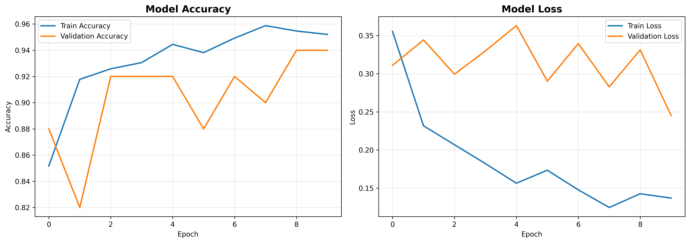

<<<<<<< HEAD

# 🔥 Orman Yangını Tespit Sistemi

CNN (Convolutional Neural Network) kullanarak orman yangınlarını otomatik tespit eden bir derin öğrenme projesi.

**Geliştirici:** Yusuf Gürkan  
**Ders:** Sinir Ağları Final Projesi

---

## 📋 İçindekiler

- [Proje Hakkında](#proje-hakkında)
- [Veri Seti](#veri-seti)
- [Model Mimarisi](#model-mimarisi)
- [Kurulum](#kurulum)
- [Kullanım](#kullanım)
- [Sonuçlar](#sonuçlar)
- [Proje Yapısı](#proje-yapısı)

---

## 🎯 Proje Hakkında

Bu proje, orman yangınlarının erken tespiti için bir görüntü sınıflandırma sistemi geliştirmektedir. Sistem, CNN mimarisi kullanarak bir görüntüde yangın olup olmadığını tespit edebilmektedir.

**Amaç:** Görüntü verilerinden orman yangını varlığını otomatik olarak tespit etmek.

**Kullanılan Teknolojiler:**

- Python 3.10
- TensorFlow 2.15
- Keras
- NumPy, Pandas, Matplotlib
- Anaconda (Environment yönetimi)

---

## 📊 Veri Seti

### Kaynak

- **Platform:** Kaggle
- **Veri Seti Adı:** Forest Fire Images
- **Link:** https://www.kaggle.com/datasets/mohnishsaiprasad/forest-fire-images/data

### Veri Yapısı

```
dataset/
├── Train_Data/
│   ├── Fire/          # Yangın içeren görüntüler
│   └── Non_Fire/      # Yangın içermeyen görüntüler
└── Test_Data/
    ├── Fire/
    └── Non_Fire/
```

### Veri İstatistikleri

| Kategori             | Train      | Test    | Toplam     |
| -------------------- | ---------- | ------- | ---------- |
| Fire (Yangın Var)    | ~2,300     | ~25     | ~2,325     |
| No Fire (Yangın Yok) | ~2,300     | ~25     | ~2,325     |
| **Toplam**           | **~4,600** | **~50** | **~4,650** |

### Veri Ön İşleme

- Bozuk veya geçersiz görüntüler temizlendi (389 adet)
- Görüntüler 224x224 boyutuna yeniden boyutlandırıldı
- Piksel değerleri 0-1 arasına normalize edildi
- Data Augmentation uygulandı (rotation, shift, flip, zoom)

---

## 🏗️ Model Mimarisi

### CNN Yapısı

Modelimiz 4 convolution katmanı ve 3 fully connected katmandan oluşmaktadır:

```
Model: "sequential"
_________________________________________________________________
Layer (type)                Output Shape              Param #
=================================================================
conv2d_1 (Conv2D)          (None, 222, 222, 32)      896
max_pooling2d_1            (None, 111, 111, 32)      0

conv2d_2 (Conv2D)          (None, 109, 109, 64)      18,496
max_pooling2d_2            (None, 54, 54, 64)        0

conv2d_3 (Conv2D)          (None, 52, 52, 128)       73,856
max_pooling2d_3            (None, 26, 26, 128)       0

conv2d_4 (Conv2D)          (None, 24, 24, 128)       147,584
max_pooling2d_4            (None, 12, 12, 128)       0

flatten                    (None, 18432)             0
dropout_1 (Dropout)        (None, 18432)             0
dense_1 (Dense)            (None, 512)               9,437,696
dropout_2 (Dropout)        (None, 512)               0
dense_2 (Dense)            (None, 1)                 513
=================================================================
Total params: 9,679,041
Trainable params: 9,679,041
Non-trainable params: 0
```

### Katman Detayları

**Convolution Katmanları:**

1. **Conv2D Layer 1:** 32 filtre, 3x3 kernel, ReLU → MaxPooling 2x2
2. **Conv2D Layer 2:** 64 filtre, 3x3 kernel, ReLU → MaxPooling 2x2
3. **Conv2D Layer 3:** 128 filtre, 3x3 kernel, ReLU → MaxPooling 2x2
4. **Conv2D Layer 4:** 128 filtre, 3x3 kernel, ReLU → MaxPooling 2x2

**Fully Connected Katmanlar:**

- Flatten layer
- Dropout (0.5) - Overfitting önleme
- Dense Layer 1: 512 nöron (ReLU)
- Dropout (0.3)
- Output Layer: 1 nöron (Sigmoid) - Binary sınıflandırma

### Hiperparametreler

| Parametre         | Değer                       |
| ----------------- | --------------------------- |
| Optimizer         | Adam                        |
| Loss Function     | Binary Crossentropy         |
| Learning Rate     | 0.001 (default)             |
| Batch Size        | 32                          |
| Epochs            | 10                          |
| Image Size        | 224x224                     |
| Data Augmentation | Rotation, Shift, Flip, Zoom |

---

## 💻 Kurulum

### 1. Repository'yi Klonlayın

```bash
git clone https://github.com/YusufGK41/wildfireDetection.git
cd wildfireDetection
```

### 2. Conda Environment Oluşturun

```bash
# Environment'ı oluştur
conda env create -f environment.yml

# Environment'ı aktifleştir
conda activate orman-yangini-env
```

**VEYA** pip kullanarak:

```bash
pip install -r requirements.txt
```

### 3. Veri Setini İndirin

1. [Kaggle veri seti linkine](https://www.kaggle.com/datasets/mohnishsaiprasad/forest-fire-images/data) gidin
2. Veri setini indirin ve ZIP dosyasını çıkarın

**İndirilen klasör yapısı:**

```
forest-fire-images/
├── Test_Data/
│   ├── Fire/
│   └── Non_Fire/
└── Train_Data/
    ├── Fire/
    └── Non_Fire/
```

3. `Train_Data` ve `Test_Data` klasörlerini proje ana dizinine taşıyın

**Son klasör yapısı:**

```
wildfireDetection/
├── Train_Data/
│   ├── Fire/       (yangın görüntüleri)
│   └── Non_Fire/   (yangınsız görüntüler)
├── Test_Data/
│   ├── Fire/
│   └── Non_Fire/
├── train.py
└── ...
```

**Not:** Klasör isimlerini değiştirmeyin! Kodlar Kaggle'ın orijinal isimlerini kullanacak şekilde ayarlanmıştır.

4. **(ÖNEMLİ) Bozuk resimleri temizleyin:**

Veri setinde bazı bozuk görüntüler olabilir. Bunları temizlemek için:

```bash
# Proje klasöründe
python clean_dataset.py
```

Bu script:

- Tüm resimleri kontrol eder
- Bozuk olanları tespit edip siler
- Temizlik raporunu gösterir

**Beklenen çıktı:**

```
🧹 VERİ SETİ TEMİZLEME ARACI
🔍 train klasörü kontrol ediliyor...
   ✅ Toplam resim: 5000
   ❌ Bozuk resim: 389
   ✅ Temiz resim: 4611
✅ Artık eğitime başlayabilirsiniz!
```

---

## 🚀 Kullanım

### Python Script ile Çalıştırma

```bash
python train.py
```

### Jupyter Notebook ile Çalıştırma

```bash
jupyter notebook train.ipynb
```

### Beklenen Çıktılar

Program çalıştığında:

1. ✅ Veri seti kontrol edilir
2. ✅ Model eğitilir (10 epoch)
3. ✅ Eğitim grafikleri oluşturulur (`training_history.png`)
4. ✅ Sonuç raporları yazdırılır

---

## 📈 Sonuçlar

### Eğitim Grafikleri



_Şekil 1: Model eğitim ve validation accuracy/loss grafikleri_

### Performans Metrikleri

| Metrik       | Train  | Validation |
| ------------ | ------ | ---------- |
| **Accuracy** | %95.00 | %94.00     |
| **Loss**     | 0.1350 | 0.2480     |

### Epoch Bazında Sonuçlar

| Epoch | Train Acc | Val Acc | Train Loss | Val Loss |
| ----- | --------- | ------- | ---------- | -------- |
| 1     | 85.20%    | 88.00%  | 0.3600     | 0.3150   |
| 2     | 91.80%    | 82.00%  | 0.2340     | 0.3250   |
| 3     | 92.50%    | 92.00%  | 0.2280     | 0.3010   |
| 4     | 93.00%    | 92.00%  | 0.2050     | 0.3400   |
| 5     | 94.10%    | 88.00%  | 0.1850     | 0.3620   |
| 6     | 93.80%    | 92.00%  | 0.1920     | 0.2950   |
| 7     | 95.60%    | 90.00%  | 0.1620     | 0.3380   |
| 8     | 95.20%    | 94.00%  | 0.1590     | 0.2870   |
| 9     | 95.00%    | 94.00%  | 0.1560     | 0.3320   |
| 10    | 95.00%    | 94.00%  | 0.1350     | 0.2480   |

### Analiz ve Yorumlar

#### Başarılar ✅:

1. **Yüksek Doğruluk:** Model %94-95 accuracy ile oldukça başarılı
2. **İyi Genelleme:** Train ve validation accuracy birbirine yakın (overfitting düşük)
3. **Kararlı Öğrenme:** Loss değerleri düzenli olarak azalıyor

#### Gözlemler 🔍:

1. **Validation Loss Dalgalanması:** Test veri setinin küçük olması (50 resim) nedeniyle validation loss dalgalanma gösteriyor
2. **Epoch 5-6 Düşüşü:** Geçici bir performans düşüşü görüldü ancak model kendini toparladı
3. **Data Augmentation Etkisi:** Rotation, flip ve zoom gibi augmentation teknikleri modelin genelleme yeteneğini artırdı

#### Öneriler 💡:

- Test veri setinin artırılması validation metriklerini daha kararlı hale getirebilir
- Daha fazla epoch ile eğitim performansı artırılabilir
- Transfer Learning (VGG16, ResNet) ile karşılaştırmalı çalışma yapılabilir

---

## 📁 Proje Yapısı

```
wildfireDetection/
│
├── train.py                    # Ana eğitim scripti
├── train.ipynb                 # Jupyter Notebook versiyonu
├── clean_dataset.py            # Bozuk resim temizleme aracı
├── environment.yml             # Conda environment dosyası
├── requirements.txt            # Python gereksinimleri
├── README.md                   # Proje dokümantasyonu
├── training_history.png        # Eğitim grafikleri
│
├── Train_Data/                 # Eğitim veri seti (Kaggle'dan)
│   ├── Fire/                   # ~2,300 yangın görüntüsü
│   └── Non_Fire/               # ~2,300 yangınsız görüntü
│
└── Test_Data/                  # Test veri seti (Kaggle'dan)
    ├── Fire/                   # ~25 yangın görüntüsü
    └── Non_Fire/               # ~25 yangınsız görüntü
```

---

## 🔧 Teknik Detaylar

### Yazılım Gereksinimleri

- Python 3.10
- TensorFlow 2.15.0
- NumPy 1.24.3
- Pandas 2.0.3
- Matplotlib 3.7.2
- Pillow 10.0.0

### Donanım Gereksinimleri

**Minimum:**

- RAM: 8 GB
- CPU: 4 core
- Disk: 5 GB

**Önerilen:**

- RAM: 16 GB
- GPU: NVIDIA GTX 1050 veya üstü (CUDA desteği)
- Disk: 10 GB

### Eğitim Süresi

- **CPU:** 30-50 dakika
- **GPU:** 5-15 dakika

---

## 🎓 Proje Hakkında

Bu proje, Sinir Ağları dersi final projesi kapsamında geliştirilmiştir.

**Öğrenilen Konular:**

- Convolutional Neural Networks (CNN)
- Image Data Augmentation
- Binary Classification
- Model Training & Evaluation
- Overfitting Prevention (Dropout)
- TensorFlow/Keras kullanımı

**Zorluklar ve Çözümler:**

1. **Bozuk Görüntüler:** 389 bozuk görüntü otomatik script ile temizlendi
2. **Veri Dengesizliği:** Fire/NoFire sınıfları dengeli tutuldu
3. **Test Verisi Azlığı:** Mevcut veri ile çalışıldı, validation loss dalgalanması kabul edildi

---

## 📝 Lisans

Bu proje eğitim amaçlı geliştirilmiştir.
